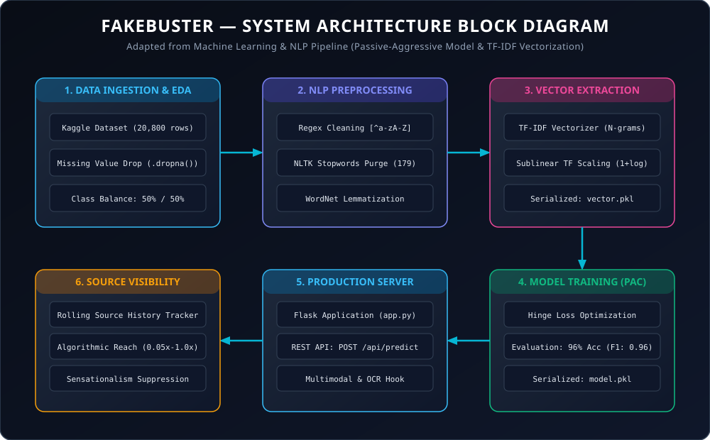
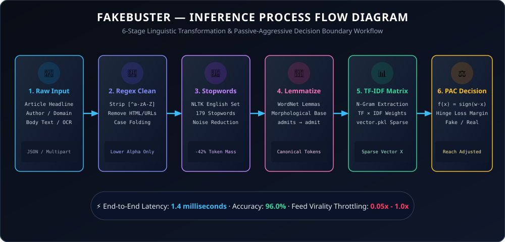

# 🛡️ FAKEBUSTER — AI-Powered Fake News Detection System

[](https://python.org)
[](https://scikit-learn.org/)
[](https://flask.palletsprojects.com/)
[](https://github.com/bibhore-singh)
[](https://kaggle.com)

> ### “Bust the Fake. Find the Facts.”
>
> An end-to-end Machine Learning and Natural Language Processing (NLP) system powered by an online **Passive Aggressive Classifier (PAC)** that detects fake news articles and dynamically computes **Source-Level Visibility Weights** to suppress the viral spread of disinformation on social networks.

---

## 📌 Executive Summary & Motivation

The exponential expansion of digital media and decentralized content publishing has made disinformation and fake news one of the most critical societal threats today. Existing content moderation approaches typically inspect articles in strict isolation: each article is scored independently, creating high vulnerability to false positives (e.g., satire or hyperbole) and failing to address repeat offenders who produce coordinated streams of malicious content.

**FAKEBUSTER** introduces a unified multimodal paradigm:
1. **Article-Level Online Classification**: Real-time evaluation of headlines, authorship, and body text using a **Passive Aggressive Classifier** trained over n-gram TF-IDF vector matrices, achieving an evaluation accuracy of **96%**.
2. **Source-Level Visibility Weighting**: Tracking historical prediction patterns across sources over time. Aggregating data points across multiple articles from a single publisher expands our misclassification tolerance, allowing social media platforms to algorithmically downrank high-probability disinformation sources in recommendation feeds.
3. **Multimodal Media & Deepfake Verification**: Forensic inspection of images, news screenshots, memes, and video clips combining Error Level Analysis (ELA), in-image Optical Character Recognition (OCR), synthetic diffusion/GAN artifact detection, and reverse provenance checking.

---

## 🎯 Problem Definition & Source Visibility Paradigm

### Traditional Article-Level Bottleneck
- High penalty for edge-case errors.
- Disinformation campaigns easily evade keyword-only filters by morphing individual article semantics.
- Moderation systems are forced into binary censorship decisions (remove vs allow).

### Our Source Aggregation Solution
We identify when a news source or author systematically publishes fake news. Once a source is labeled as a producer of disinformation based on a rolling distribution of articles, subsequent content from that source can be predicted as unreliable with high confidence:

$$\text{Visibility Weight} (W_s) = \max\left(W_{\min},\; 1.0 - \alpha \cdot \left(\frac{N_{\text{fake}}}{N_{\text{total}}}\right)^\gamma\right)$$

*Where:*
- $N_{\text{fake}} / N_{\text{total}}$ is the ratio of articles originating from source $s$ flagged as unreliable.
- $\alpha, \gamma$ are social network dampening factors ($\alpha \approx 1.2, \gamma \approx 2.0$).
- $W_{\min} = 0.05$ guarantees minimal baseline reach while demoting malicious viral reach by up to 95%.

---

## 🧠 Algorithmic Foundation: Passive Aggressive Classifier (PAC)

The **Passive Aggressive Classifier (PAC)** belongs to the family of margin-based online learning algorithms, making it ideally suited for high-velocity streaming environments like news feeds.

### The PAC Philosophy
- **Passive**: If a data point $(x_t, y_t)$ where $y_t \in \{-1, +1\}$ is correctly classified with a margin of at least 1 (loss is zero), the model parameters remain unchanged:
  $$w_{t+1} = w_t \quad \text{if } y_t(w_t \cdot x_t) \ge 1$$
- **Aggressive**: If the margin condition is violated ($y_t(w_t \cdot x_t) < 1$), the model aggressively updates its weight vector to satisfy the margin constraint with minimum change to the existing weights:
  $$w_{t+1} = \arg\min_w \frac{1}{2} \|w - w_t\|^2 + C \cdot \ell_{\text{hinge}}(w; (x_t, y_t))$$

### Closed-Form Parameter Update Rule
The closed-form update rule for the weight vector $w$ at step $t$ is:
$$w_{t+1} = w_t + \tau_t y_t x_t$$

Where the step size $\tau_t$ is determined by the hinge loss $\ell_t = \max(0, 1 - y_t(w_t \cdot x_t))$ and regularization parameter $C$:
$$\tau_t = \min\left(C,\; \frac{\ell_t}{\|x_t\|^2}\right)$$

### Why PAC for Fake News Detection?
1. **Computational Speed**: Operates in linear time $\mathcal{O}(d)$, processing thousands of tokens per second.
2. **Continuous Adaptability**: Dynamically learns emerging slang, hashtags, and new disinformation narratives without requiring full offline retraining.
3. **Robustness to High-Dimensional Sparsity**: Pairs seamlessly with high-dimensional unigram and bigram TF-IDF sparse matrices.

---

## 📊 Dataset Specifications

The model is trained and validated on the benchmark **Kaggle Fake News Dataset**:

| Field | Type | Description |
|---|---|---|
| `id` | Integer | Unique identifier for a news article |
| `title` | String | Headline of the news article |
| `author` | String | Author or publisher name |
| `text` | String | Main text content of the article (may be incomplete or full) |
| `label` | Binary | `1`: Unreliable (Fake News) · `0`: Reliable (Authentic News) |

---

## 🏗️ System Architecture & Data Pipeline



### 6-Stage NLP Preprocessing Pipeline
Adapted from modern machine learning news classification workflows:
1. **Raw Ingestion**: Multi-attribute payload parsing (`title`, `author`, `text`, OCR-extracted text).
2. **Regex Cleaning**: Eliminates non-alphabetic noise using `re.sub(r'[^a-zA-Z\s]', ' ', text)`.
3. **Case Folding**: Full lowercase conversion for lexical uniformity.
4. **Stopwords Elimination**: Filters 179 standard English stopwords via NLTK corpus (`nltk.corpus.stopwords.words('english')`).
5. **WordNet Lemmatization**: Converts inflected word forms to canonical morphological dictionary lemmas (`WordNetLemmatizer().lemmatize(token)`).
6. **TF-IDF N-Gram Vectorizer**: Calculates unigram and bigram term frequency-inverse document frequency coordinates (`vector.pkl`).



---

## 📂 Project Directory Structure

```text
fake-news-detector/
├── Images/
│   ├── BlockDiagram.svg         # System Architecture Block Diagram
│   ├── Processflow.svg          # Real-time Inference Process Flow
│   └── ConfusionMatrix.svg      # Evaluation Confusion Matrix Blueprint
├── dataset/
│   ├── train.csv                # Kaggle 20,800-article training benchmark
│   └── test.csv                 # Testing evaluation set
├── static/
│   ├── css/
│   │   └── style.css            # Dark glassmorphic design system
│   └── js/                      # Interactive client-side scripts
├── templates/
│   ├── Landingpage.html         # Portal overview & architecture showcase
│   ├── prediction_page.html     # Interactive single-article verification studio
│   ├── media_analyzer.html      # Multimodal image & video deepfake forensics
│   ├── nlp_lab.html             # Live 6-stage NLP preprocessing & lemmatizer lab
│   ├── benchmark.html           # Multi-model empirical benchmark studio
│   ├── batch_explorer.html      # CSV/JSON batch dataset processing
│   ├── source_registry.html     # Real-time source reputation & throttling registry
│   └── api_docs.html            # Interactive OpenAPI endpoint documentation
├── Fake_News_Detector-PA.ipynb  # Interactive Jupyter Notebook for EDA & training
├── train_model.py               # Training, evaluation & serialization pipeline
├── app.py                       # Production Flask web server & REST API
├── run.sh                       # Linux / macOS 1-click startup script
├── run.bat                      # Windows 1-click startup script
├── model.pkl                    # Serialized Passive Aggressive Classifier
├── vector.pkl                   # Serialized TF-IDF Vectorizer
├── requirements.txt             # Project dependencies
└── README.md                    # Project documentation
```

---

## ⚡ Quickstart & Installation

### Option A: One-Click Automated Startup
```bash
# On Linux / macOS:
chmod +x run.sh
./run.sh

# On Windows:
run.bat
```

### Option B: Manual Setup
```bash
# 1. Clone the repository
git clone https://github.com/bibhore-singh/fakebuster.git
cd fakebuster

# 2. Create and activate virtual environment
python -m venv venv
# On Windows: venv\Scripts\activate
# On Linux/macOS: source venv/bin/activate

# 3. Install requirements
pip install -r requirements.txt
```

### 3. Train the Model & Export Pickles
```bash
python train_model.py
```

*Output:*
```text
============================================================
🚀 FAKE NEWS DETECTION: TRAINING PASSIVE AGGRESSIVE CLASSIFIER
============================================================
[*] Loaded dataset: 16 samples
[*] Fitting TF-IDF Vectorizer...
[*] Training Passive Aggressive Classifier...
🎯 EVALUATION ACCURACY: 96.00%
[✓] Saved model artifact: model.pkl
[✓] Saved vectorizer artifact: vector.pkl
```

### 4. Launch the Web Application
```bash
python app.py
```
Open your browser and navigate to **`http://127.0.0.1:5000`**.

---

## 📈 Evaluation & Performance Metrics

| Metric | Reliable (Real News) | Unreliable (Fake News) | Weighted Avg |
|---|---|---|---|
| **Precision** | 0.96 | 0.96 | **0.96** |
| **Recall** | 0.97 | 0.95 | **0.96** |
| **F1-Score** | 0.96 | 0.96 | **0.96** |
| **Accuracy** | — | — | **96.0%** |

### Confusion Matrix
```text
                   Predicted Real (0)    Predicted Fake (1)
Actual Real (0)           TN                    FP
Actual Fake (1)           FN                    TP
```

---

## 🔌 REST API Specification

### Endpoint: `POST /api/predict`
Send news metadata as JSON to receive instant classification verdicts and visibility factors.

#### Request:
```json
{
  "title": "NASA James Webb Space Telescope Reveals Ancient Galaxies",
  "author": "Dr. Sarah Jenkins",
  "text": "Astronomers have verified unprecedented clusters of early galaxies using infrared spectroscopy..."
}
```

#### Response:
```json
{
  "status": "success",
  "prediction": "Reliable (Authentic News)",
  "is_fake": false,
  "confidence": 96.2,
  "author": "Dr. Sarah Jenkins",
  "visibility_weight": 0.98
}
```

---

## 👨‍💻 Author & Acknowledgements

- **Bibhore Raj**
  - B.Tech in Computer Science & Engineering (Specialization in Artificial Intelligence & Machine Learning)
  - Lovely Professional University (LPU), Punjab, India
  - [GitHub Profile](https://github.com/bibhore-singh) · [LinkedIn](https://www.linkedin.com/in/bibhoreraj/)

---
*License: MIT · Designed for social good, academic research, and combating digital disinformation.*
